World to basis - Blender addon
==============================

I wanted to be able to set the absolute location and rotation for a camera at a frame other than the first frame. This proved harder than I expected and the tiny addon here is my current solution.

**TLDR;** jump to the [addon](#addon) section.

The issue
---------

If you've solved for camera motion and pressed _Setup Tracking Scene_, then you've attached a _Camera Solver_ constraint to your camera. You can see this constraint in the _Object Constraint_ properties tab:

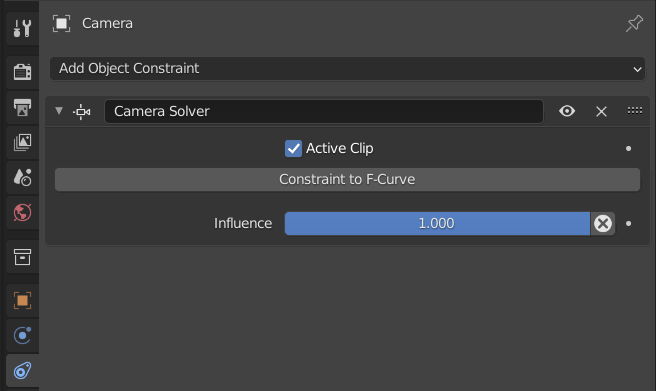

If you select the camera so you can see its location and rotation in the _3D Viewport_ sidebar, you'll notice something odd as you scrub through the frames. Even though the camera is moving, the location and rotation values remain unchanged.

E.g. look at the rotation values, here in frame 1 of my clip (you can see the frame number in brackets, to the left of "foreground" in the upper-left corner):

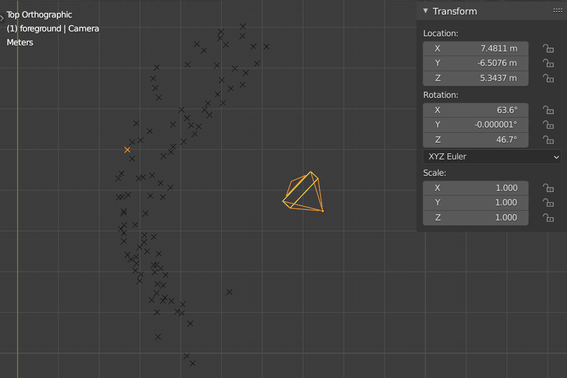

Now look at the rotation values, here in frame 210. They're unchanged despite the camera clearly having rotated between the image above and this one:

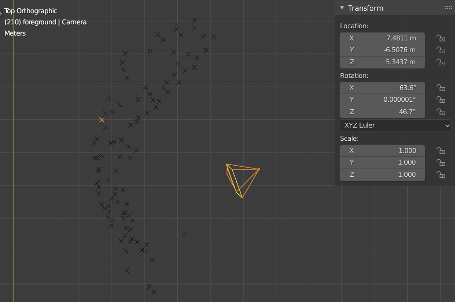

The issue is that Blender just displays the location, rotation and scale values as they are before the motion (that's a consequence of the _Camera Solver_ constraint) is applied. These values are called basis values.

I wanted to be able to set the absolute location and rotation of the camera for a particular frame. E.g. if I want the camera to be pointing directly backwards at frame 148, I'd like to be able to enter 0 in the Z _Rotation_ field. However, if I do this, I'll affect the basis value and the camera will _start_ facing directly backwards but then move from there until its facing some other direction by frame 148.

You can sort of achieve what I want by eyeballing things, i.e. in frame 148, you can select the camera and rotate it such that it's facing directly backwards. But there seems to be no way of doing this by adjusting the absolute values.

Motivation
----------

I wanted to be able to set the location and rotation of my camera to match the values of a camera created with fSpy.

I'd solved for the motion of a camera that had been mounted on a tripod - due to the lack of parallax in such a setup, this results in Blender essentially projecting all the trackers onto a virtual curved screen that the camera pans across. Even though this doesn't reflect the 3D reality of the original scene, it actually works out fine but it has the consequence that Blender has no idea what the floor is.

This is where a tool called [fSpy](https://fspy.io/) comes into play. Given a single frame it can work out the location of the camera and makes it easy to set the origin (and from there your floor when back in Blender).

However, I wanted to use fSpy on a particular frame rather than the first one. As you can see, frame 148 was much more convenient, than frame 1, for lining up the vanishing point lines etc. that fSpy needs.

| Frame 1 | Frame 148 |
|:-------:|:---------:|
| 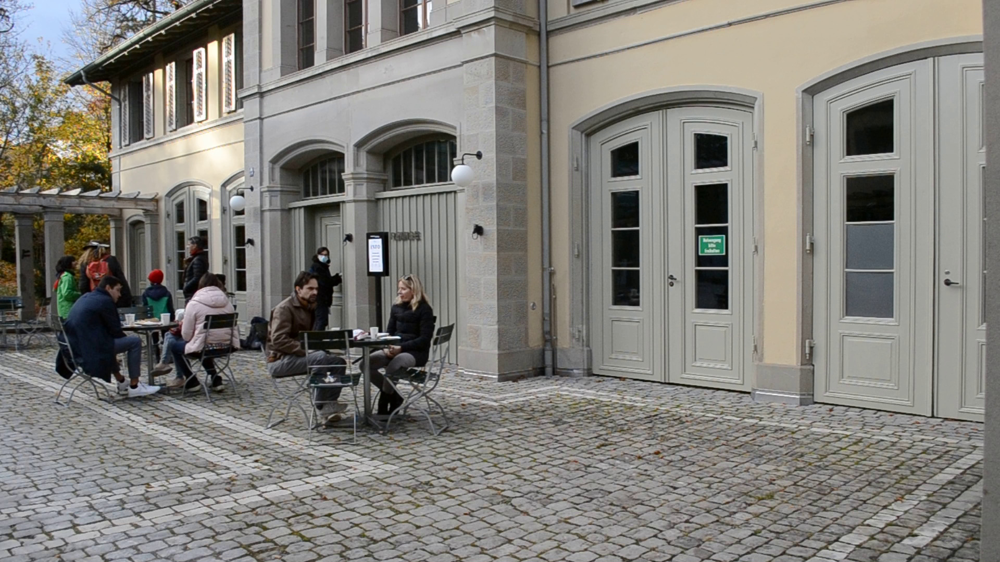 | 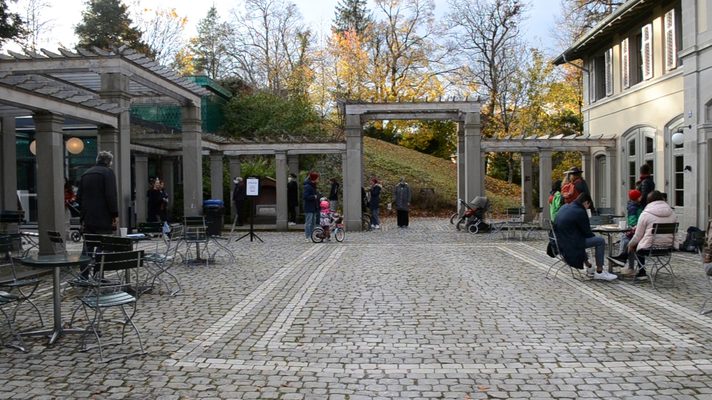

_fSpy_  
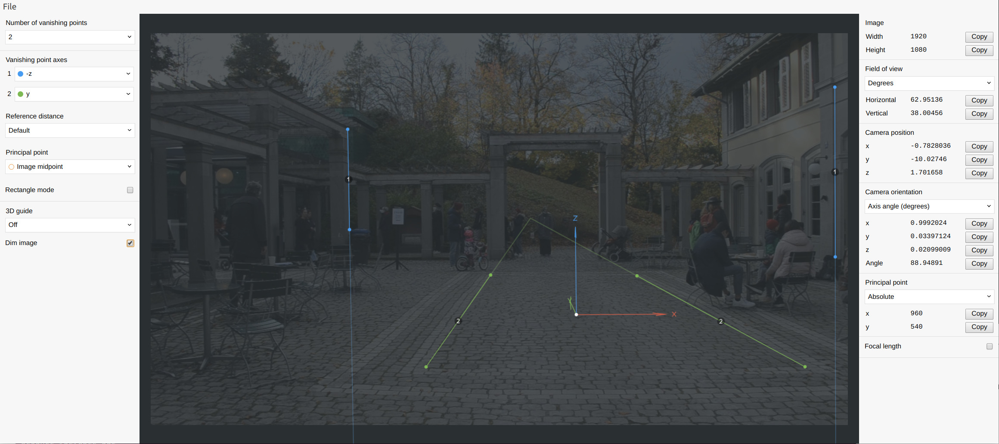

Once you've created your fSpy project, you can it import into Blender - this results in a second camera. Here you can see the fSpy camera bottom-left and the original camera to the right of it at the position that it currently has at frame 148:

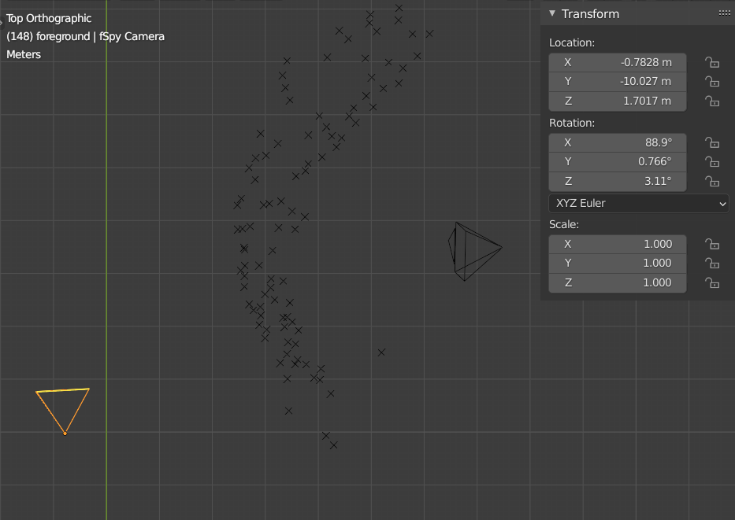

So I want to copy the location and rotation of the fSpy camera to the original camera. However, every way I could find to copy these values from one to the other resulted in setting the basis values rather than the values for the camera when it was at frame 148.

Solution
--------

I couldn't find any way to solve this other than resorting to Blender's Python API.

Once in the Python world, things are simple enough. Assume that we've already somehow assigned the original camera and the fSpy camera objects to the variables `camera` and `fspy`, then we can achieve what we want with two lines of matrix math:

```python
factor = fspy.matrix_world @ camera.matrix_world.inverted_safe()
camera.matrix_basis = factor @ camera.matrix_basis
```

`camera.matrix_world` is the matrix that describes the location, rotation and scale of `camera` in frame 148 and `camera.matrix_basis` is its basis location, rotation and scale. We determine a `factor` that transforms between the `matrix_world` value for `camera` and that of `fspy` and then apply that `factor` to the `matrix_basis` of the `camera`.

### Explanation

Let's just define _cw_ as the world location of the original camera and _sw_ as the world location of the fSpy camera. If _cw_ and _sw_ were just scalars then finding the factor that gets one from _cw_ to _sw_ is easy:

1. cw * factor = sw
2. &rArr; factor = sw / cw
3. &rArr; factor = sw * 1&frasl;cw
4. &rArr; factor = sw * cw<sup>-1</sup>

There's no such thing as matrix division but there is matrix inversion, so we can calculate _cw<sup>-1</sup>_. And hence the first line of Python above. Once we've got this factor we can apply it to the basis matrix and so this factor is essentially applied for all frames and will get the camera to where we want it in the relevant frame (in this case frame 148).

Addon
-----

So I bundled this logic into a tiny addon. Just save the file [`world_to_basis.py`](world_to_basis.py) locally, then go to _Edit / Preferences / Add-ons_, click _Install..._, select your copy of `world_to_basis.py` and click _Install Add-on_.

The first time you install it, it should appear automatically (with its name filled-in in the search field), otherwise just start typing "world to basis" in the search field until you see it:

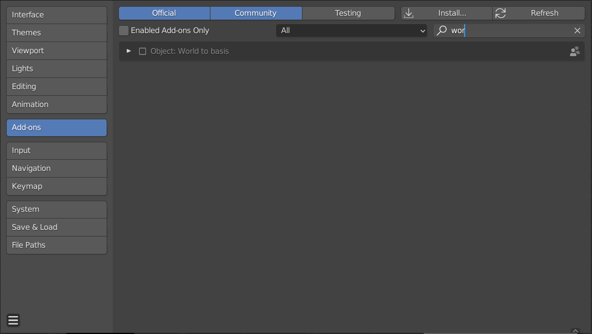

Just tick the checkbox to enable it and close the _Preferences_. You should then see an additional section called "World to Basis" in the _Item_ tab of the _3D Viewport_ sidebar:

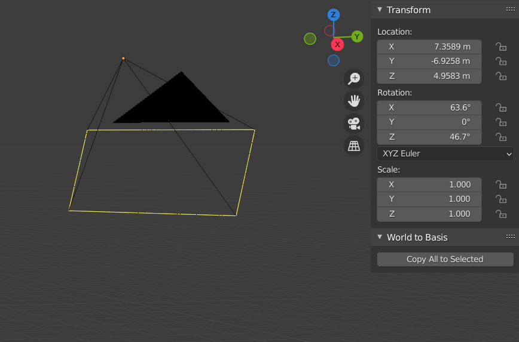

To use, scrub to the relevant frame, select the original camera, then shift-select the fSpy camera and, in the _Item_ tab, press the _Copy All to Selected_ button in the _World to Basis_ section.

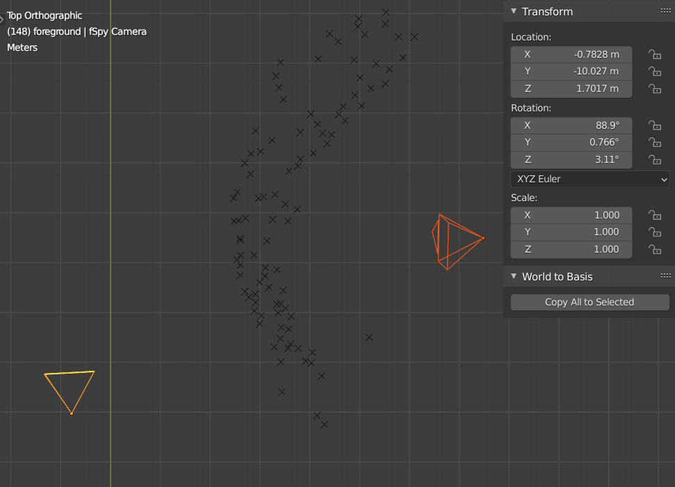

Going further
-------------

This started with me wanting to be able to set the current (rather than basis) location, rotation and scale values of an object that was subject to constraints. This addon doesn't provide access to X, Y and Z fields for current location etc. but it gets close. If e.g. don't want to use fSpy at all but want to set the exact location, rotation and scale of your camera at a particular frame then scrub to that frame, create a temporary cube and enter the exact values you want for the camera in the location, rotation and scale fields of the cube. Then select the camera, shift-select the cube and copy over the values as already described - then delete the cube.

Working with the first frame
----------------------------

Above, I claimed the first frame, in my particular clip, was harder to work with than frame 148. This isn't really true, it's fairly easy to set the vanishing-point axes in frame 1 to get a similar result:

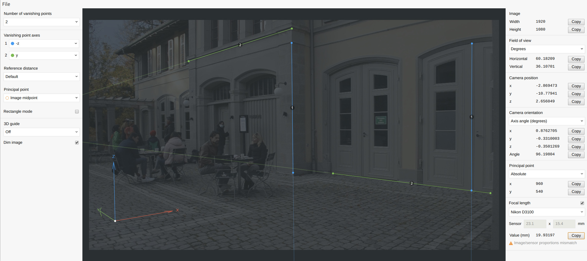

However, working with frame 1, I can't set the origin where I want it, i.e. in the middle of the courtyard.

Note that in this screenshot, I've also ticked _Focal length_ and that the solved length is very close to the 18mm that I actually had the camera set to.